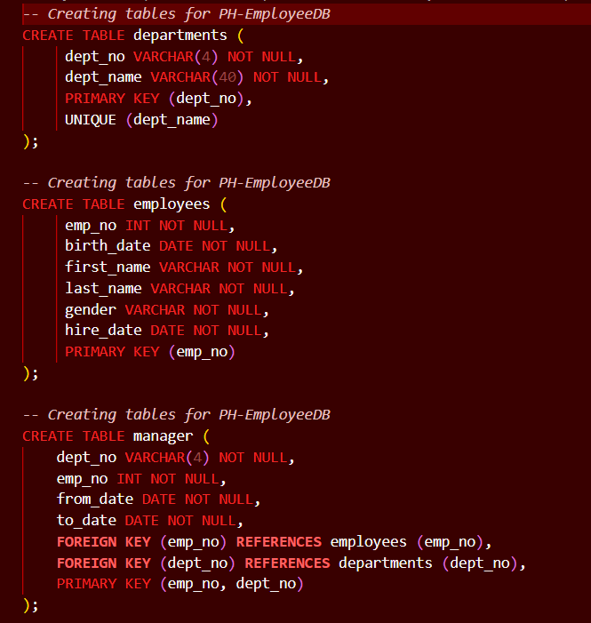
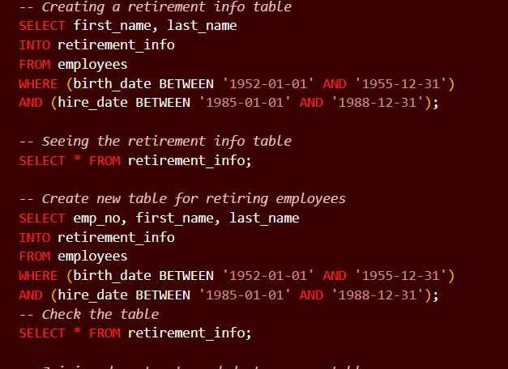

# Pewlett-Hackard-Analysis

## Introduction
Pewlett Hackard is a large company the consists of many employees of varying ages and positions. **This analysis aims to use SQL to filter Pewlett-Hackards csv databases to clearly show who is eligible to retire and mentorship eligibility.**This consisted of creating four easy to understand csv’s to display the extracted information.
### CSV’s created:
* Mentorship eligibility
* Retirement titles
* Retiring titles
* Unique titles
# Extraction of Data
Information to create the former CSV’s were extracted from six different CSV’s. Using the ERD below, it was clear where primary keys were in each respective file.

###ERD of Extacting CSV’s

This ERD clearly demonstrates where to join our tables and on what key. This allowed for SQL queries to be written as the one below. 

Then, also from the ERD tables extracting and merging data from previously given CSV files was made easy into an SQL query. 

## Results
Over all this analysis had four major points from finding retirement eligible employees and unique titles.
* Firstly, it is important to create an ERD prior to writing your queries to visualize how to join given data.
* Secondly,  it was really important to know the data of birth cut off for when the company allows an employee to retire so the data can be filtered more easily.
* Third, in order to make query writing faster SQL allows abbreviations of the table names using the AS command, which makes queries cleaner. 
* Lastly, it is important to note the one should add their data cleaning towards the end of their query to ensure less errors. 
## Summary
Additionally, there were to major questions answered by two additional queries. 
1)	How many unique titles are there in the company?
Answer: 72,458 unique titles which is evidenced in the CSV unique titles.
2)	How many retiring titles are there?
Answer: 7 unique retirement titles evidenced by the retiring titles CSV.
